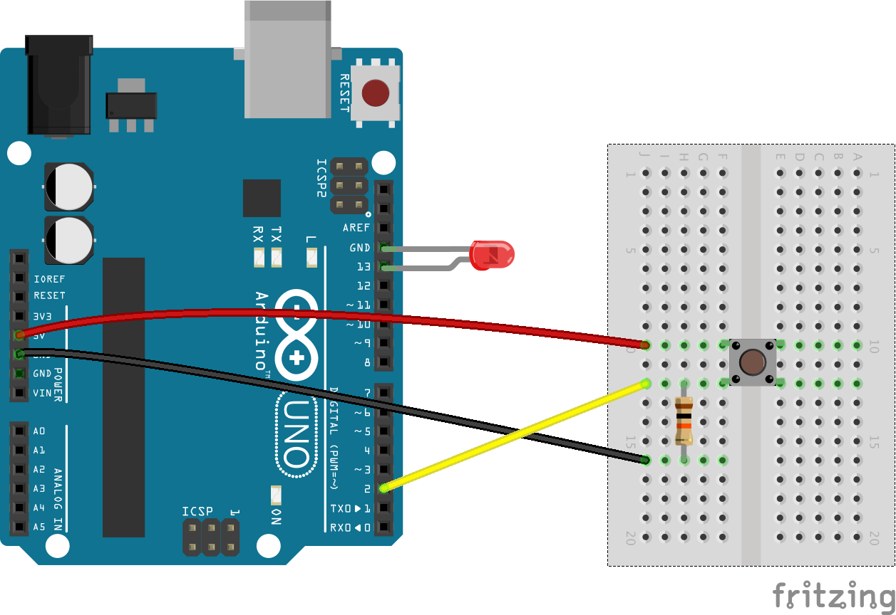

# Building a Video Walkie Talkie!

## Blink LED

1. Install Hardware Extention for PageNodes - https://chrome.google.com/webstore/detail/hardware-extension-for-pa/knmappkjdfbfdomfnbfhchnaamokjdpj?utm_source=chrome-ntp-launcher

2. Connect LED to Arduino 

3. Plug Arduino into Chromebook

4. Open web browser to https://pagenodes.com

5. Add Johnny5 node (under Functions) to page and double click on node.

6. Configure board:
  - Nodebot = Arduino/Firmata
  - Connection = Serial port
  - Port = /dev/tty...
  - Name = Arduino 101

7. Copy and paste this code into onReady:
```javascript
var led = new five.Led(13);
led.blink();
```

8. Click Deploy (top right). Congratulations!!!  Your LED should start blinking!

## Add Push-To-Talk Button

1. Wire button on breadboard and connect to Arduino


2. Double click on Johnny5 node again and copy/paste this code into onReady replacing your previous code:
```javascript
var led = new five.Led(13);
var button = new five.Button(2);

button.on("hold", function() {
  led.on();
  node.send({payload:'hold'});
});

button.on("press", function() {
  led.on();
  node.send({payload:'on'});
});

button.on("release", function() {
  led.off();
  node.send({payload:'off'});
});
```

3. Add a Debug node (under Output) to page and connect it to Johnny5 and double click on Debug node.

4. Set output to message property msg.payload to debug tab.

5. Click Deploy (top right). Congratulations!!!  Your LED should turn on when button is pressed!

## Add Video When Button is Pushed

1. Delete Debug node.

2. Add a Switch node (under Functions) to page and connect it to Johnny5. Double click on Switch node.  Add rule that shows == on

3. Add Camera node (under Functions) and connect it to Switch node.

4. Add a Debug node (under Output) to page and connect it to Camera node and double click on Debug node.

5. Set output to message property msg.payload.image to debug tab.

6. Click Deploy (top right). Congratulations!!!  Your LED should turn on when button is pressed and video snapshots should appear in your Debug tab on the right side of your page!

## Create Video Chat Room

1. Delete Debug node.

2. Add Meshblu node (under Output) and connect it to camera node and double click Meshblu node.

3. Edit Meshblu node to add a new server:
   - click the button to create a new uuid and token.
   - uncheck the broadcast checkbox
   - in "To a specific uuid" use: `1b22e194-942e-4a91-aba4-96873f05da71`

4. Below the flow, add Meshblu node (under Input) and double click Meshblu node. Uncheck Direct to Me. Add broadcast from `1b22e194-942e-4a91-aba4-96873f05da71` and click OK.

5. Add a Debug node (under Output) to page and connect it to new Meshblu input node and double click on Debug node.

6. Set output to complete message object to debug tab.

7. Click Deploy (top right). Congratulations!!!  Your LED should turn on when button is pressed and video snapshots should appear in your Debug tab on the right side of your page along with everyone else from your class!
